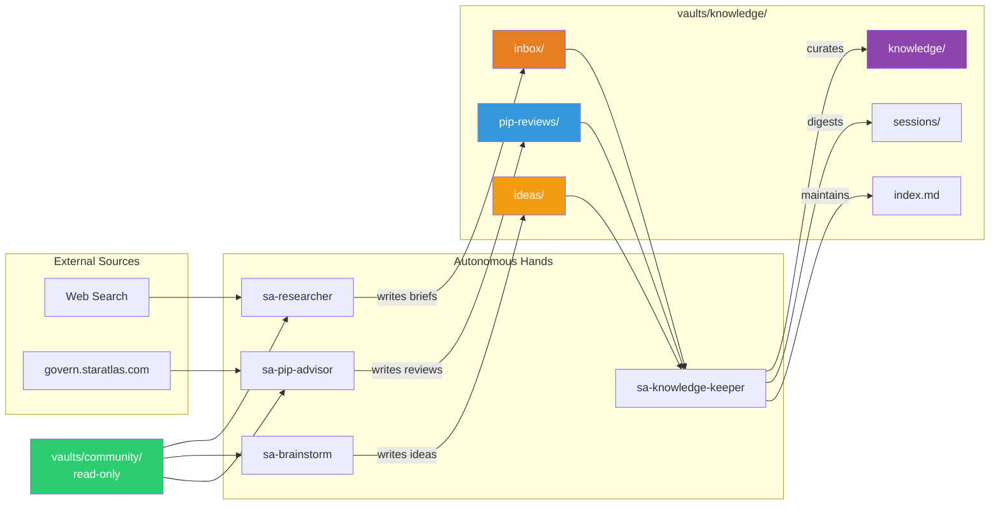
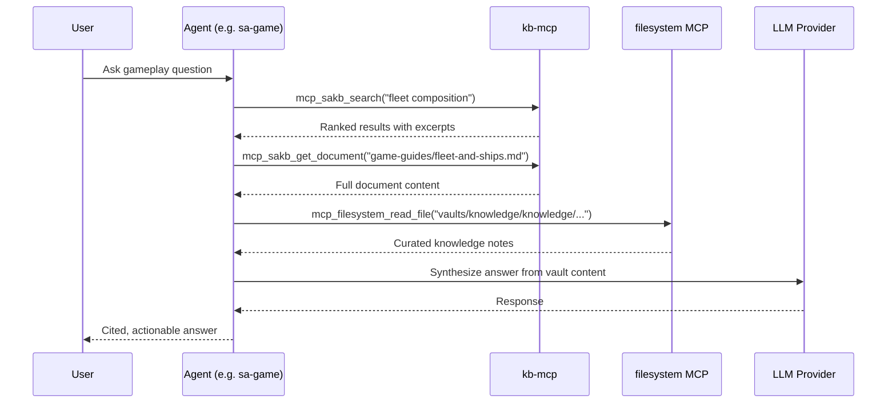

# Data Flow

How information moves through the swarm — from external sources through research, ideation, and curation into structured knowledge that interactive agents can query.

## Hand Pipeline

## Knowledge Vault Structure

| Directory | Written by | Read by | Purpose |
|---|---|---|---|
| `inbox/` | sa-researcher | sa-knowledge-keeper | Raw research briefs |
| `ideas/` | sa-brainstorm | sa-knowledge-keeper | Creative brainstorm output |
| `pip-reviews/` | sa-pip-advisor | sa-knowledge-keeper, sa-govern | Governance analysis |
| `knowledge/` | sa-knowledge-keeper | All agents | Curated atomic facts |
| `sessions/` | sa-knowledge-keeper | — | Session digests |
| `index.md` | sa-knowledge-keeper | All agents | Root index |

## Agent Query Flow

Interactive agents answer questions by searching both vaults:

