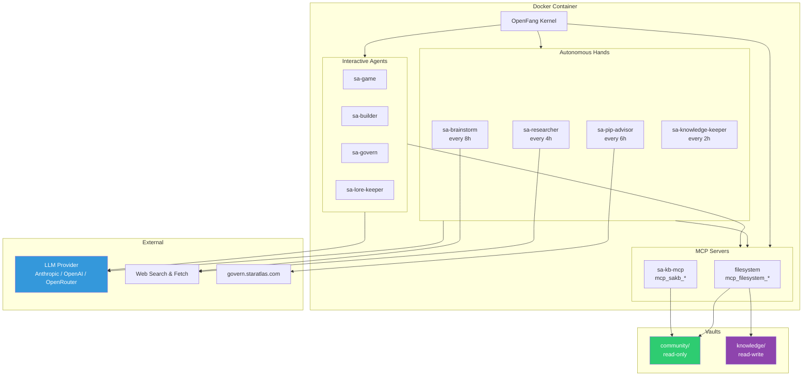

# System Overview

The swarm runs on OpenFang Agent OS inside Docker. All infrastructure is defined as code — agent definitions, schedules, vault structure, and MCP server config are version-controlled.

## Architecture Diagram

## Key Design Decisions

- **Infrastructure as Code** — all config is version-controlled. Dashboard is for monitoring, not configuration.
- **Read-only community vault** — agents never write to `vaults/community/`. Agent output goes to `vaults/knowledge/`.
- **Hands disabled by default** — each tick consumes LLM tokens. Activate only what you need.
- **Dual MCP servers** — `filesystem` for direct file access, `sakb` (sa-kb-mcp) for full-text search over the community vault.
