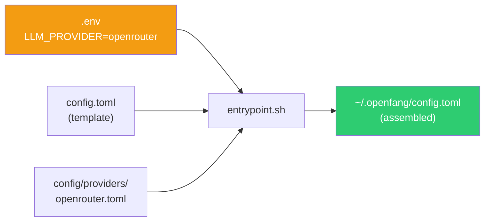

# LLM Providers

The swarm supports three LLM providers. Set `LLM_PROVIDER` in `.env` to select one — the entrypoint assembles the final config at startup from provider presets in `config/providers/`.

## Available Providers

| `LLM_PROVIDER` | API Key | Model | Notes |
|---|---|---|---|
| `anthropic` (default) | `ANTHROPIC_API_KEY` | Claude Sonnet 4.6 | Direct Anthropic API |
| `openai` | `OPENAI_API_KEY` | GPT-5.2 | Via [VibeProxy](https://github.com/automazeio/vibeproxy) on host |
| `openrouter` | `OPENROUTER_API_KEY` | Gemini 2.5 Flash | 200+ models via OpenRouter |

## How It Works



1. `config.toml` is a template with a `__LLM_PROVIDER__` placeholder
2. `entrypoint.sh` reads `LLM_PROVIDER` from the environment
3. The matching preset from `config/providers/` is injected into the placeholder
4. The assembled config is written to `~/.openfang/config.toml`

## Switching Providers

Edit one line in `.env`:

```bash
LLM_PROVIDER=openrouter
OPENROUTER_API_KEY=sk-or-...
```

Then `just rebuild`. No manual editing of `config.toml` needed.

## Adding a New Provider

Create a new file in `config/providers/`:

```toml
# config/providers/my-provider.toml
[default_model]
provider    = "openai"
model       = "my-model"
api_key_env = "MY_PROVIDER_API_KEY"
base_url    = "https://my-provider.example.com/v1"
```

Set `LLM_PROVIDER=my-provider` in `.env` and `just rebuild`.

## OpenAI via VibeProxy

The `openai` provider uses [VibeProxy](https://github.com/automazeio/vibeproxy) to proxy a ChatGPT subscription into an OpenAI-compatible API. VibeProxy runs on the macOS host and the Docker container reaches it via `host.docker.internal:8317`.

```bash
# Install VibeProxy on macOS host
# See: https://github.com/automazeio/vibeproxy

# Set in .env
LLM_PROVIDER=openai
OPENAI_API_KEY=vibeproxy
```

The `docker-compose.yml` includes `extra_hosts` for `host.docker.internal` if you need to add it.
